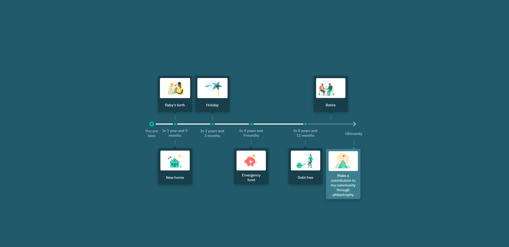

## LifeCheq

Application for timeline component built with React, JavaScript, and SCSS.
## Project Screen Shot(s)

## Installation and Setup Instructions

Clone down this repository. You will need `node` and `npm` installed globally on your machine.  

Installation:

`npm install`  

To Run Test Suite:  

`npm test`  

To Start Server:

`npm start`  

To Visit App:

`localhost:3000`  

## Reflection

This was a small project built for the LifeCheq frontend assignment.
It contains a simple timeline component, which displays timeline items with images in the timeline component. It has only one page, so no react-router was added, as it is unnecessary. 
Styling is done with pure SCSS from scratch, with no frameworks, so only one NPM dependency was added.

Timeline data is loaded from a JSON file as we don't fetch data from the backend server. 

The project structure is straightforward:
- assets (folder for images, icons, audio, video, and other multimedia files)
- components (contains simple components)
- constants (contains text and other constants)
- modules (folder for components that are fetching data and have side effects)
- pages (folder for views/pages, one component is one route in the project)
- styles (contains SCSS files for component styles, mirrors components directory structure)
- utils (folder for utility scripts)

There is no complex logic, state, or user feature in this app, so no tests are added.

The project is set up with recommended linter and formatter for react typescript apps.